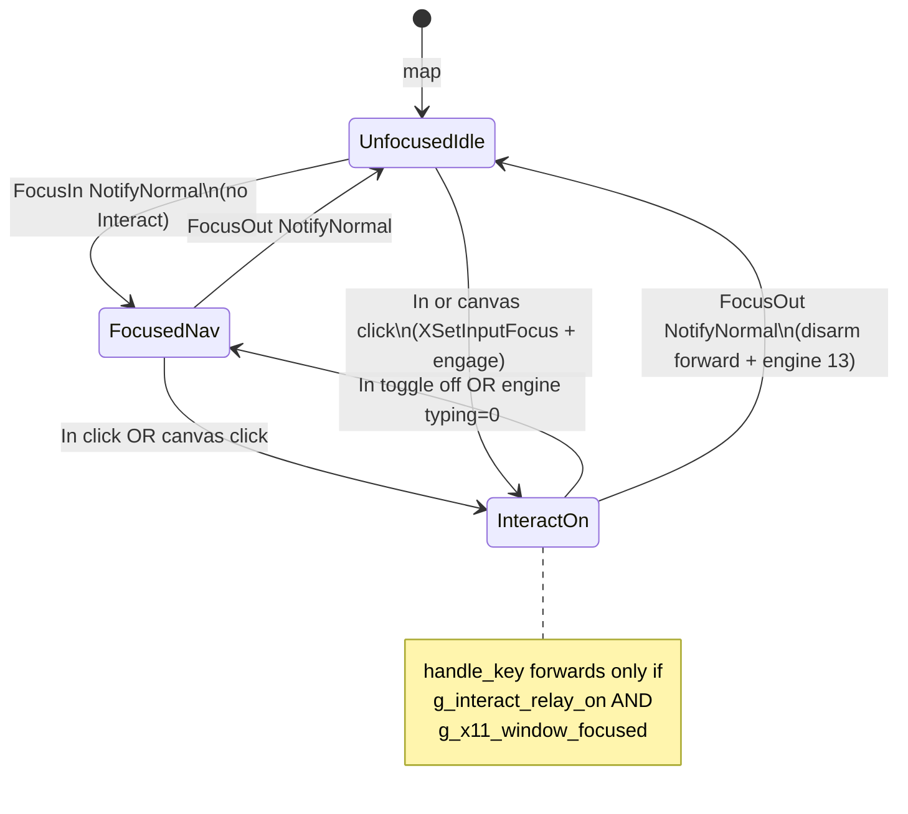
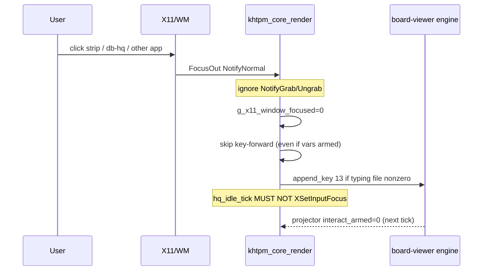
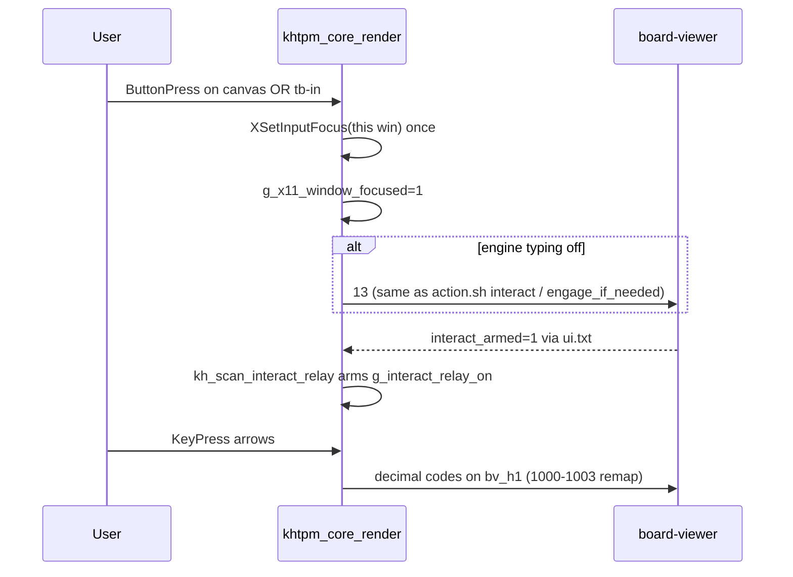

# pc-hq Interact: deactivate on real focus loss; re-engage from In or canvas click

| Field | Value |
|---|---|
| **Author** | grok (design only; no code in this task) |
| **Date** | 2026-09-08 |
| **Status** | Draft |
| **House** | `44.xyz.01.00` |
| **Canonical copy** | `#.#.calendar-dox/!.HQ-IQ-BOOK/08-roadmap/design-docs/PC-HQ-FOCUS-AND-INTERACT-ACTIVATE.md` |
| **Prior art** | `09-appendix/pc-hq-leg-vs-nu-fix.md` (§2-B, §5-A/B, §6, §6c); commit `828b0cfe` (WM-managed + var-arm) |

---

## Overview

Interact Mode now arms and hardware keys can reach the WM-managed pc-hq board (class `managed`, var-arm in `kh_scan_interact_relay()`). The remaining defect is **focus hogging**: `hq_idle_tick()` (~7745) calls `XSetInputFocus` whenever the pointer is over the window and `XGetInputFocus` reports another client. Hover therefore steals keyboard focus back after the user has clicked strip, db-hq, or any other app.

The user wants two layers to stay in sync, without collapsing them:

- **A — X11 window focus:** who receives `KeyPress`.
- **B — Interact Mode:** `g_interact_relay_on` plus engine `active_gui_is_typing.txt`.

**Leave the window** (real `FocusOut`, not grab noise) → deactivate Interact **and** stop stealing focus. **Click In** (toolbar / numbered nav) **or click the play screen** (`<canvas id="view">` blit, not a play button) → take focus **and** engage Interact. Mere `FocusIn` (alt-tab back, title click, chrome) must **not** auto-engage.

---

## Background & Motivation

### What landed (`828b0cfe` / §6c)

- `pchq-board.xhtpm`: `<window class="pchq-board-pal database-window managed">`.
- Window create ~14409: `win_managed = dock_managed || elem_has_class(g_window, "managed")`; `g_win_managed_focus = win_managed && !dock_managed`. **Keep.** Do not revert to `override_redirect`.
- `kh_scan_interact_relay()` ~4424: arms from projector vars `interact_class` / `interact_armed` / `bv_h1` every idle tick (does **not** consult X11 focus).
- Projector `pchq_board_projector.c`: publishes `interact_class` / `interact_armed` from `active_gui_is_typing.txt`.
- `pchq_board_action.sh` verb `interact`: `append_key 13` (engine toggle).

### The hog (`hq_idle_tick`, ~7745)

```c
if (g_win_managed_focus && dpy && win) {
    XGetInputFocus(dpy, &fw, &frev);
    if (fw != win) {
        if (XQueryPointer(...) && pointer is inside g_win_w/h)
            XSetInputFocus(dpy, win, RevertToParent, CurrentTime);
    }
}
```

This is a port of LEG §2-B `pchq_focus_ok` (per-loop steal until `focused == win`). LEG lived in a dedicated 810-line loop where that window *was* the game. NU shares the desktop with strip / db-hq / other khtpm clients. Pointer-over steal is the wrong invariant.

### Related current code

| Site | Behavior |
|---|---|
| `handle_key()` ~6884 | If `g_interact_relay_on`, **every** key including Escape is forwarded; local nav never runs. |
| FocusIn/FocusOut ~8181 | Title `^` / `.` only; **must ignore** `NotifyGrab` / `NotifyUngrab` / `NotifyWhileGrabbed` / pointer details (existing flicker comment). Does not touch Interact. |
| Canvas | Generic `handle_mouse` → element activate. `<canvas id="view" sprite="${canvas_raw}"/>` has **no** `onclick` / `action`. |
| `tb-in` | `action=… pchq_board_action.sh … interact`, `relay=${bv_h1},${bv_h2}`. |

Pain: user clicks another window; pointer still over pc-hq (or they move back without intending game keys) → focus returns; Interact stays armed from vars; keys never reach the other app.

---

## Goals & Non-Goals

### Goals

1. **Deactivate on real window-focus loss.** Real `FocusOut` (`NotifyNormal`; grab modes ignored) → skip key-forward even if projector still says armed; optionally toggle engine (`13`) so `active_gui_is_typing.txt` matches; never `XSetInputFocus` to steal it back.
2. **Activate / reactivate** only from:
   - **In** (`tb-in` click or numbered nav activate of that item — existing `action.sh interact`);
   - **Play screen** = click on `<canvas>` board blit in `pchq-board.xhtpm`.
3. **Local click may take X11 focus** (`XSetInputFocus` after `ButtonPress` on *this* window), but **FocusIn alone does not engage Interact**.
4. Generic gates only: `g_win_managed_focus` and/or `class="managed"` and/or (canvas + relay item present). **No** `g_is_pchq`.
5. Keep WM-managed window (§5-A). Hog is §5-B steal, not managed vs override_redirect.

### Non-Goals

- Revive `run_pchq_board_mode()` (~810 lines).
- Display-wide `XGrabKeyboard` (2026-09-04 house-wide keyboard death; §6).
- New layout branches / khtpm-house-standards violations.
- Auto-engage Interact because the window merely regained focus (alt-tab, title drag, chrome `!` / `_` / `x`).
- `prisc+x` popen freeze (§5-optional) — separate track.
- Hardware keyboard verification in this design task (required **later** at implementation; synthetic XTest is not evidence).

---

## Key Decisions

1. **Two layers, two flags.** `g_x11_window_focused` (or reuse painted `g_focus_owned` from FocusIn/Out) is **not** the same as `g_interact_relay_on`. Key-forward requires **both**: window focused **and** projector/user-armed Interact.
2. **Delete idle pointer-over `XSetInputFocus`.** LEG per-frame steal is the hog. Idle tick may *observe* `XGetInputFocus` for the title indicator; it must **not** re-assert unless a *local* click (or explicit In/canvas engage) happened this session since last real FocusOut.
3. **FocusOut disarm is renderer-local first.** Immediately `g_interact_relay_forward_ok = 0` so `handle_key` never swallows keys that will not even arrive. Engine sync (`append_key 13` / write typing `0`) is best-effort and **idempotent** (only if currently on).
4. **FocusIn does not engage.** User said activate from nav click **or** play-screen click — not “window focused again.”
5. **Canvas click is a generic rule**, not `g_is_pchq`: if this window is `g_win_managed_focus` (or `class="managed"`) **and** a page item has `relay=` **and** the hit Elem is `tag=="canvas"`, treat as Interact engage (same as In: take focus + `13` if engine off). Prefer template `onclick`/`action` on canvas if that stays generic without a C special case; otherwise one generic hit-test in mouse activate.
6. **No unbounded grab.** If WM focus still flakes after (1)–(5), only then consider FocusOut-bounded grab (§6) as a **later** PR — not this design’s default.
7. **Keep `class="managed"`** at create. Dock stays independently managed; override_redirect popups unchanged.

---

## Proposed Design

### State machine (layers A and B)



### Sequence: click-away



### Sequence: re-engage from canvas or In



### Layer A — stop the steal

**Change `hq_idle_tick()` (~7745):** remove the `XQueryPointer` + `XSetInputFocus` block entirely **or** gate it behind a sticky `g_want_focus_assert` that is set **only** by:

- `ButtonPress` whose event window is `win` (any chrome/canvas/toolbar click on this client);
- explicit Interact engage path.

Clear `g_want_focus_assert` on real `FocusOut`. While cleared, idle must never call `XSetInputFocus` even if the pointer is over the window and `fw != win`.

**Optional one-shot after local click:** `XSetInputFocus` in the mouse path (already used elsewhere ~7337, ~14499 post-map). Post-map retry at create **stays** (map-time only, not per-tick).

**Never steal when `XGetInputFocus` is another client** unless the local-click latch is set. That is the user’s “do not steal” rule.

### Layer B — Interact vs focus

**`kh_scan_interact_relay()` (~4424):** keep var-arm (`interact_class` / `interact_armed` / `bv_h1`) so reparse lag does not freeze the badge. **Additionally:**

- If `!g_x11_window_focused`, do **not** set `g_interact_relay_on` for *forwarding* (or set a separate `g_interact_forward_ok=0`). Projector may still show `In: ON` for one tick until engine 13 lands; keys must not be claimed locally if they are not even delivered.
- `handle_key()`: `if (g_interact_relay_on && g_x11_window_focused)` before the forward-and-return block. If armed-in-engine but unfocused, this process should not see keys; if it does (WM glitch), still do not swallow them for local nav of a window that is not focused.

**FocusOut (~8223):** after the existing grab filter (~8195):

```c
if (g_win_managed_focus) {
    g_x11_window_focused = 0;
    g_want_focus_assert = 0;
    kh_interact_disengage_engine_if_on(); /* 13 to relay paths if vars/typing say on */
}
```

**FocusIn (~8202):** `g_x11_window_focused = 1` for title `^`. **Do not** call engage / `13` / `XSetInputFocus` storm.

**Engine sync helper (generic):** if relay paths known (`g_interact_relay_paths` or `bv_h1`) and `interact_armed`/`interact_class` say on, append `13\n` once (debounce: do not double-toggle). Prefer reusing the same write as `handle_key` forward, **not** a new `g_is_pchq` shell. Do **not** write `active_gui_is_typing.txt` from the renderer if the engine owns that file — `13` is the contract (`pchq_board_action.sh` `interact` / `restore_interact`).

### Canvas / In activate

**In:** already `action.sh interact` → `append_key 13`. After FocusOut disarm, clicking In toggles engine on again; var-arm picks it up. Mouse path should `XSetInputFocus` this window (local click latch). Numbered nav activating `tb-in` is the same `action` string — no extra C.

**Canvas (play screen):** today no `onclick`. Two acceptable shapes (prefer 1 if it needs zero new C branches):

1. **Template:** `<canvas id="view" … action="'${HOUSE}/…/pchq_board_action.sh' '${bv_session}' 'interact'"/>` **or** `onclick` same as `tb-in`, **if** generic activate already runs `action`/`onclick` for `canvas` tags. **Must verify** `handle_mouse` hit-test includes `canvas` (layout assigns geometry ~4861). If canvas is painted but not in the activate hit list, (1) is insufficient.
2. **Generic C rule:** on ButtonPress, if hit tag is `canvas` **and** (`g_win_managed_focus` **or** window has class `managed`) **and** page has any `item` with `relay=`, then: local focus latch + same engage as In (`13` if off; if already on, **stay on** — click play screen is **activate/reactivate**, not toggle-off). Toggle-off remains In / engine ESC / FocusOut.

**Do not** treat chrome (`close`, `fullscreen`, `minimize`, File/Desk) as interact-engage.

### Title indicator

Keep FocusIn/Out grab filter. `^` / `.` continues to reflect **X11** focus (`g_focus_owned_painted`), not Interact. Interact badge remains `In: ON/off` from projector.

---

## API / Interface Changes

No new public C API. Renderer statics only:

| Symbol | Role |
|---|---|
| `g_win_managed_focus` | **unchanged** create-time gate |
| `g_x11_window_focused` | **new** (or derive from existing paint flag) |
| `g_want_focus_assert` | **new** latch; idle steal **off** unless set |
| `g_interact_relay_on` | still projector-driven; forward gated by focus |

Template (optional if mouse already activates canvas): `action=` on `#view` matching `tb-in`, with **engage-if-needed** semantics (action.sh `interact` is currently a **toggle** — see data model).

---

## Data Model Changes

- **No** new files required if FocusOut writes `13` to existing `bv_h1` (`interact_relay.txt`) / `bv_h2`.
- **Toggle hazard:** `action.sh interact` is unconditional `append_key 13`. Canvas **reactivate** must not fire `13` if already on (would turn **off**). Use `engage_if_needed` semantics for canvas; In may remain toggle (user expectation for the In *button*). Document this split in the template comment.
- Projector continues to publish `interact_armed=0|1` from `file_has_nonzero(typing)`. No schema migration.
- **Do not** have the renderer truncate `active_gui_is_typing.txt` unless engine fails to honor `13` — that file is engine-owned.

---

## Alternatives Considered

### Alt 1 — Keep hover steal (status quo / LEG §2-B)

- **Pros:** LEG camera never lost keys while the pointer lingered; one-line mental model.
- **Cons:** Explicitly the hog. Breaks strip/db-hq/other-app typing whenever the pointer is over pc-hq. **Rejected.**

### Alt 2 — FocusOut-bounded `XGrabKeyboard`

- **Pros:** Keys guaranteed while Interact on; §6 already specified grab released on real FocusOut (`g_is_cursword` pattern).
- **Cons:** 2026-09-04 display-wide death if disarm fails; house rule: do not unbounded grab; even bounded grab is last resort after WM-managed + no-steal. **Deferred**, not default.

### Alt 3 — Idle steal **only if already focused** (`fw == win` no-op; steal only when `fw == PointerRoot` / `None`)

- **Pros:** Recovers focus after WM drops to root without fighting another client.
- **Cons:** Still steals from “no focus” in ways that surprise; does not implement “leave window → deactivate Interact.” Does not stop hog if Mutter reports another client slowly. **Insufficient alone.** May be a **narrow** extra: re-assert only if `fw` is `None`/`PointerRoot` **and** latch is set. Not hover-over-other-client.

### Alt 4 — Auto-engage Interact on any FocusIn

- **Pros:** Clicking the title bar would start the game.
- **Cons:** Contradicts the user: activate from **In or play-screen**, not mere window focus. Chrome clicks would trap keys. **Rejected.**

---

## Security & Privacy Considerations

- No new network or credential surface.
- Relay writes remain append-only decimal codes to session history files under the live board-viewer tree (same as today).
- **Threat:** FocusOut `13` toggling a session the user did not own — mitigated because paths come from this window’s projector `bv_h1` only.
- **Threat:** steal-focus as a key-sniff vs other clients — **this design removes** that class of behavior.

---

## Observability

- Title `^` / `.` = layer A.
- `In: ON/off` = layer B (projector).
- Debug (implementation): one-line stderr or existing dump: `managed_focus=%d x11=%d latch=%d relay_on=%d fw=0x%lx` on FocusIn/Out and on suppressed idle steal.
- Metrics: not a service; no counters required.
- Alert: none. Regression signal is “keys in other apps die while pointer over pc-hq.”

---

## Risks

| Severity | Risk | Mitigation |
|---|---|---|
| **High** | Removing idle steal → click-back without canvas/In does not route hardware keys (old §3-B). | Local `ButtonPress` on **any** part of the window still `XSetInputFocus` (layer A) without engaging Interact (layer B). User can then click canvas/In for game keys. |
| **High** | FocusOut `13` double-toggle (engine already off, or FocusOut+Ungrab misclassified). | Honor existing grab filter; debounce; only send `13` if `interact_armed`/typing nonzero. |
| **Med** | `NotifyWhileGrabbed` currently ignored for title; a real click-away during a grab might delay disarm. | If live test shows stuck Interact after menu grab, treat `NotifyNormal` **and** selected `NotifyWhileGrabbed` with `detail==NotifyNonlinear` as loss — still **never** `NotifyGrab`/`NotifyUngrab`. |
| **Med** | Canvas not in mouse hit-test. | Verify geometry ~4861; if miss, add generic canvas hit or `action=` plus hit inclusion. |
| **Low** | In is toggle; canvas must be engage-if-needed. | Split in action.sh or C: canvas uses `engage_if_needed`. |
| **Low** | Dock `g_win_managed_focus` is false (`win_managed && !dock_managed`). | No behavior change for strip. |

---

## Rollout Plan

1. Renderer-only PR: remove hover steal; latch + FocusOut skip-forward. Engine `13` can be same PR or immediate follow.
2. Canvas engage generic rule / template `action`.
3. Relaunch running pc-hq windows (renderer rebuild is not live-patched).
4. **Rollback:** revert the steal-removal commit; `class="managed"` stays. Do **not** rollback §5-A to fix a steal bug.
5. Feature flags: none; behavior is the managed+relay window class. No PDL bit required.
6. **Hardware verification is mandatory** before calling it done (see below). XTest/`xdotool` is not evidence (`pc-hq-leg-vs-nu-fix.md` §9).

---

## Verification (hardware vs relay)

### Relay / file (dev can do without claiming “fixed”)

- After FocusOut path: `interact_relay.txt` gains `13` if typing was on; projector `interact_armed` → 0.
- After canvas/In: `13` if was off; `kh_scan_interact_relay` arms.
- `_NET_CLIENT_LIST` still lists pc-hq; `xwininfo` Override Redirect = no.

### Real hardware (owner / later implementation)

| Step | Expected |
|---|---|
| Interact ON, arrows move camera | unchanged from `828b0cfe` |
| Click strip / db-hq / other app | those apps get keys; pc-hq does **not** steal on hover |
| `In:` goes off (or keys no longer eaten) | layer B |
| Click pc-hq **title/chrome** only | window focused (`^`); Interact **stays off** until In/canvas |
| Click **canvas** | focus + Interact ON + arrows |
| Click **In** | toggle/engage as today; after deactivate, In re-engages |
| Escape while engaged | still forwarded (engine ESC); not stolen by local nav |

---

## Open Questions

1. Should chrome click (not canvas) take X11 focus without Interact? **Design default: yes** (layer A latch).
2. Exact `FocusOut` modes beyond `NotifyNormal` if Mutter delivers click-away as `NotifyWhileGrabbed` — confirm on hardware.
3. Canvas: template `action=` vs C generic rule — depends on whether `canvas` is already an activate target.
4. If engine ignores `13` under load (`restore_interact` already retries), should FocusOut retry? Prefer one shot + projector tick; avoid a 2s sleep in the renderer.

---

## References

- `#.#.calendar-dox/!.HQ-IQ-BOOK/09-appendix/pc-hq-leg-vs-nu-fix.md` especially §2-B, §5-A/B, §6, §6c
- `44.xyz.01.00/*.monads/*.livedesk-taskbar/ops/khtpm_core_render.c` — `g_win_managed_focus`, `hq_idle_tick` ~7745, `kh_scan_interact_relay` ~4424, `handle_key` ~6884, FocusIn/Out ~8181, create ~14409
- `@.apps/piececraft-hq/pchq-board.xhtpm`, `ops/pchq_board_projector.c`, `ops/pchq_board_action.sh`
- `03-pitfalls/X11-AND-SESSION-PITFALLS.md` (display-wide grab)
- `CENTROID_GOLD_STD.md` / khtpm-house-standards (no new layout branches; hardware test later)

---

## PR Plan

### PR 1 — Stop idle focus steal; track real X11 focus

- **Title:** `fix(khtpm): managed windows must not XSetInputFocus on pointer-over`
- **Files:** `44.xyz.01.00/*.monads/*.livedesk-taskbar/ops/khtpm_core_render.c`
- **Depends on:** none (`828b0cfe` already on branch)
- **Changes:** Remove or latch-gate `hq_idle_tick` pointer-over `XSetInputFocus`. Set `g_x11_window_focused` on real FocusIn/Out (keep grab ignore). `ButtonPress` on this window sets latch + one `XSetInputFocus`. `handle_key` forwards Interact only if focused. **Do not** change `class="managed"` create path.

### PR 2 — FocusOut disengages engine Interact (`13`)

- **Title:** `fix(khtpm): real FocusOut sends interact-off 13 when relay armed`
- **Files:** `khtpm_core_render.c` (helper next to `kh_scan_interact_relay`); optionally comment in `pchq_board_action.sh`
- **Depends on:** PR 1 (need a trustworthy FocusOut flag)
- **Changes:** On real FocusOut for `g_win_managed_focus`, if projector/vars say armed, append `13` once to relay paths. Debounce. No `XGrabKeyboard`. No typing-file clobber unless `13` is proven insufficient in a follow-up.

### PR 3 — Canvas click engage (generic); In unchanged

- **Title:** `fix(pchq-board): canvas click engages Interact without pchq-only mode`
- **Files:** `pchq-board.xhtpm` and/or `khtpm_core_render.c` mouse activate; `pchq_board_action.sh` if canvas needs `engage_if_needed` vs toggle
- **Depends on:** PR 1 (focus latch on click); PR 2 optional but recommended so leave/re-enter is a full loop
- **Changes:** Generic rule: `canvas` + managed + relay present → focus latch + engage-if-needed. Verify `tb-in` still toggles. No `g_is_pchq`. No `run_pchq_board_mode`.

### PR 4 (optional, only if hardware still flakes)

- **Title:** `fix(khtpm): FocusOut-bounded keyboard grab for managed+relay windows`
- **Files:** `khtpm_core_render.c` only
- **Depends on:** PRs 1–3 proven insufficient on **real** keyboard
- **Changes:** `XGrabKeyboard` while Interact **and** focused; `XUngrabKeyboard` on real FocusOut / disarm. Same cursword-style bound. **Not** display-wide unbounded. House may reject; keep as contingency.
