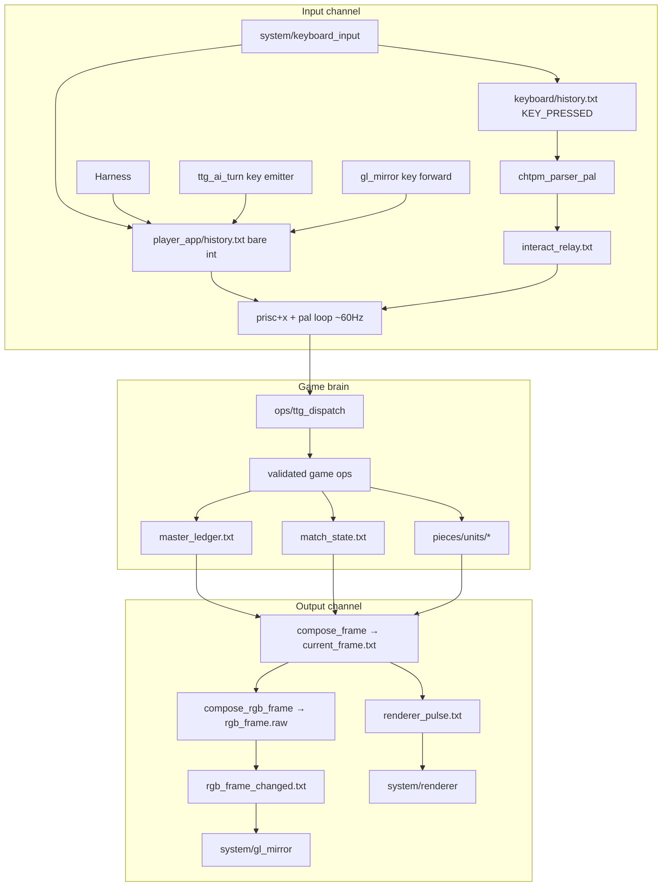
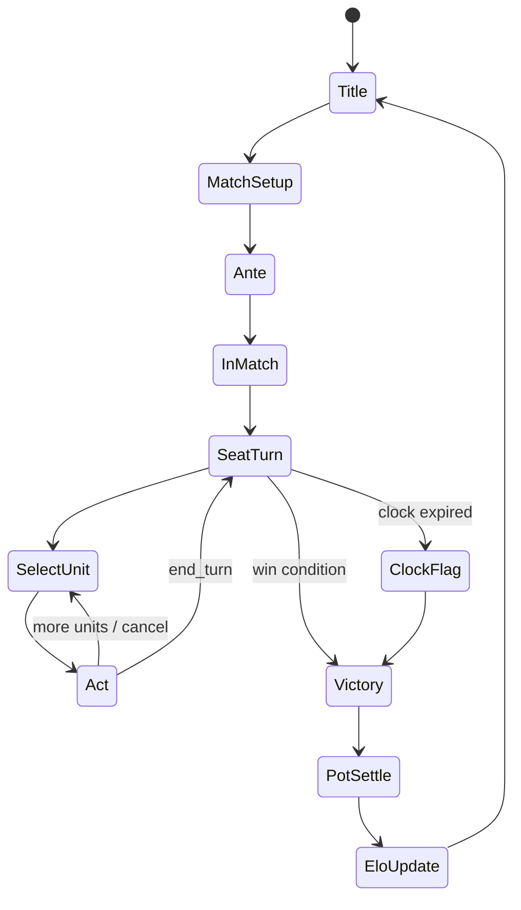
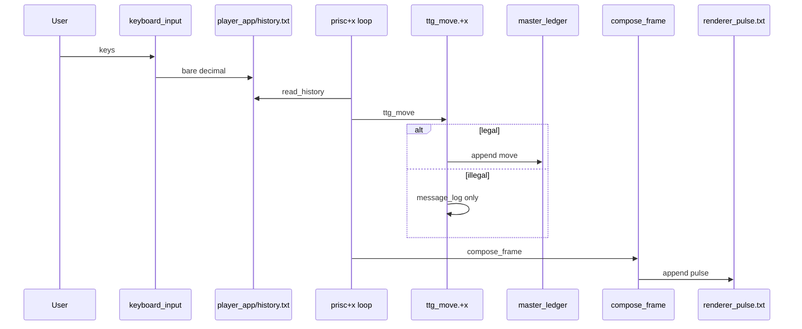

# Community Tabletop Tactics (TTG-Tactics) — Design Document

| Field | Value |
|-------|--------|
| **Title** | Community Tabletop Tactics (TTG-Tactics) |
| **Working titles** | Community Chess · Tablepot Tactics · Muchi Tabletop |
| **Project slug** | `205.ttg-tactics` |
| **Author** | _TBD_ |
| **Date** | 2026-07-28 |
| **Status** | Draft (rev 2 — implementable rules + Key Decisions + PR Plan) |
| **Architecture lineage** | House CHTPM + master ledger + ASCII/RGB dual renderer + `gl_mirror` (muta / LPNS spirit) |
| **Explicit non-path** | Freeglut-only clone (`200.glut-craft`, `204.sw-battlefront`, freeglut-first `203.gb-pokemon` runtime) |

---

## 1. Overview

**Community Tabletop Tactics** is a competitive, turn-based tactics game for PC/Steam positioning itself as a **chess + poker alternative**: chess-like clocks and board tactics, layered with poker-like stakes (ante / pot / winner-takes-all), and a living cast of **community-member pieces** (teacher, baker, clown, …) instead of abstract chess pieces.

The product ships as a **muta-style house package** at `205.ttg-tactics/`. All process boundaries talk only through plain text files. Game truth lives in `data/master_ledger.txt` (and related state files). The ASCII frame (`pieces/display/current_frame.txt`) is the nav/UI source of truth; RGB is a glyph raster of that frame; `gl_mirror` blits only.

**Human input, product AI, and harnesses share one primary path:** append keycodes to the same history files `keyboard_input` writes (see §4.1 dual-format detail). Ops validate legality; illegal actions never append to the ledger.

MVP delivers **local vs AI**, **ELO-rated** 1v1 matches, a concrete **12×12** board, time controls, locked action economy, and a **local pot economy**. Story mode, human multiplayer beyond hot-seat, and real-stakes bridging are staged extensions that do not break file-mediated architecture.

---

## 2. Background & Motivation

### 2.1 Why this product

- Chess is pure tactics but dry thematically; poker is social/economic but weak on spatial play. Hybrid “tablepot tactics” is under-served on Steam.
- House already owns a battle-tested **file-mediated game OS** (mutaclsym, LPNS, pal-chain wallets). A freeglut one-shot would be faster to demo and **wrong for the house** — it would not be harness-testable the same way, would not dual-render, and would not share PDL/ledger DNA with pets, agents, and chain products.
- Community-member units create natural expansion surface: new roles = new registry rows + skill ops, not engine rewrites.

### 2.2 Current house state (what we reuse)

| Capability | Reference | Use in TTG |
|------------|-----------|------------|
| Signal flow (keys → ledger → frame → RGB → GL) | `CHTPM_ARCHITECTURE_GUIDE.txt`, muta `dox/05-file-mediated-io-architecture.md` | Canonical runtime |
| Spatial map + ledger reconstruction | `101.lpns+map+4`, `00.lpns+map-BLUEPRINT.txt` | Board positions, replay |
| Dual render + fonts | muta `ops/compose_frame.c`, `ops/compose_rgb_frame.c`, `pieces/registry/fonts/ascii/` | ASCII + GL |
| Launch / kill | muta `button.sh` + `system/orchestrator.c` (**forked** for TTG order; see §4.1.6) | POSIX launch |
| AI / harness input | `%.harnesses/*` (workdir + proof + ops/+x **and** history inject) | Bot + automated tests |
| Money / wallets (file inspiration) | `041.pal-chain⛓️/wallets/*/wallet.txt` | **Inspired** schema; TTG uses simplified TC wallet (§4.9) |
| Roster / PDL tables | muta `project.pdl`; **data shapes only** from `203.gb-pokemon` | Piece definitions, skills |
| Turn ring + multi-actor | LPNS `config.txt` (`num_players`, `player_N_type`, **1-based**) | Mapped to **0-based seats** (§4.4) |

### 2.3 Pain points this design avoids

1. **Freeglut monolith**: game state trapped in process memory → harnesses cannot append keys and read frames.
2. **Menus invented only in GL**: breaks ASCII truth and agent observability.
3. **Pipes/sockets in core loop**: violates house law; hard to debug; AI path diverges from human path.
4. **Real money in core ledger**: would couple product to compliance from day one; pot must be **abstract currency first**, with a clean adapter boundary.
5. **Dual brain paths for AI**: product AI that bypasses key validation diverges from human legality (mitigated in §4.11).

---

## 3. Goals & Non-Goals

### 3.1 Goals

| ID | Goal |
|----|------|
| G1 | Ship playable **local solo vs AI** and **hot-seat local multi** under house CHTPM runtime. |
| G2 | **ELO** ladder (file-backed, **simple Elo K=32, 1v1 only in MVP**) for AI difficulty scaling. |
| G3 | Concrete **12×12 board** with frame line-budget that fits dual render (§4.5, §4.13). |
| G4 | **Community piece roster** (MVP subset playable; full 10 roles by Phase 2) with registry-driven skills. |
| G5 | Chess-like **time controls** (2 / 5 / 10 / 30 min per side) with per-seat clocks. |
| G6 | Locked **move + main action** economy (§4.7.2) — tactics, not real-time RTS. |
| G7 | **Pot / ante** economy in local Tablechips; architecture ready for real-stakes adapter later. |
| G8 | Dual render: terminal via `renderer_pulse` **and** `gl_mirror` via `rgb_frame_changed` from ASCII/RGB compose path. |
| G9 | Harness + product AI prefer **same history keycode path** as humans; shared validation in ops. |
| G10 | Phased path to **story mode** without freeglut story binary. |

### 3.2 Non-Goals (v1 / MVP)

| ID | Non-goal |
|----|----------|
| NG1 | Real-money gambling, payment processors, KYC (`STAKES_MODE=real` non-goal until adapter RFC). |
| NG2 | Real-time simultaneous RTS combat. |
| NG3 | Online matchmaking / netcode in MVP. |
| NG4 | Full freeglut product path (forbidden). |
| NG5 | Pixel-art engine separate from house RGB glyph pipeline. |
| NG6 | Complete story campaign at MVP. |
| NG7 | Perfect chess rule clone. |
| NG8 | Glicko / multi-seat FFA Elo in MVP. |
| NG9 | Mid-match pot raises in MVP (ante-only). |
| NG10 | Fog of war in MVP. |
| NG11 | Status-effect combat (Teacher/Lawyer/Clown full kits) in Phase 1 — stubs only. |

---

## 4. Proposed Design

### 4.1 Canonical signal flow (HARD CONSTRAINT)

```
keyboard_input
  → pieces/apps/player_app/history.txt     (bare decimal keycodes; prisc read_history)
  → pieces/keyboard/history.txt            (KEY_PRESSED: N; chtpm_parser_pal bridge)
  → chtpm_parser_pal → pieces/apps/player_app/interact_relay.txt
  → prisc+x + pal/main_loop (ops)
  → data/master_ledger.txt  (+ data/match_state.txt, pieces/units/*)
  → ops/compose_frame → pieces/display/current_frame.txt   [ASCII source of truth]
  → ops/compose_rgb_frame → pieces/display/rgb_frame.raw
       + grow pieces/display/rgb_frame_changed.txt         [downstream RGB pulse]
  → system/renderer watches pieces/display/renderer_pulse.txt  (SIZE growth)
  → system/gl_mirror watches pieces/display/rgb_frame_changed.txt  (blit only)
```

Also: after compose, grow **`renderer_pulse.txt`** (authoritative for terminal `system/renderer.c` in current muta — it deliberately does **not** watch `frame_changed.txt` to avoid stale frames). `game_dispatch`-style code may still append `frame_changed.txt` as an upstream “something changed” marker; TTG docs treat:

| File | Writer | Consumer |
|------|--------|----------|
| `pieces/apps/player_app/history.txt` | `keyboard_input`, harness, AI, `gl_mirror` key forward | `prisc+x` `read_history` / `game_dispatch` equivalent |
| `pieces/keyboard/history.txt` | `keyboard_input` (`KEY_PRESSED: N`) | `chtpm_parser_pal` |
| `pieces/apps/player_app/interact_relay.txt` | `chtpm_parser_pal` | pal / dispatch |
| `pieces/display/current_frame.txt` | `compose_frame` | `renderer`, agents, harness |
| `pieces/display/renderer_pulse.txt` | compose/hit path after ASCII ready | `system/renderer` |
| `pieces/display/rgb_frame.raw` + `.receipt.txt` | `compose_rgb_frame` | `gl_mirror` |
| `pieces/display/rgb_frame_changed.txt` | `compose_rgb_frame` (after raw write) | `gl_mirror` |
| `pieces/display/frame_changed.txt` | optional upstream | **not** terminal renderer in live muta |

**Pal loop rate:** match muta `pal/main_loop_chtpm.pal`: `sleep 16667` (**microseconds**, ~60 Hz), **not** 30 ms. LPNS +3 docs mention ~30 ms; TTG product path follows muta.

#### 4.1.1 Laws (non-negotiable)

1. Process boundaries talk **only** through plain text / raw buffer files; no pipes/sockets for the core loop.
2. **Primary input law:** anything that “plays the game” (human, product AI, harness scenario A) appends to the **same history files** humans use. Product AI emits **key sequences** (or a thin op that **only** appends keys). Direct op calls are allowed **only** in harness infrastructure for setup/seed/assert (house `%.harnesses/*` hybrid), not as a second live product brain.
3. ASCII frame is nav/UI truth; GL does not invent menus.
4. `master_ledger.txt` + match snapshots hold game truth; ops are small C `+x` binaries or pal-dispatched ops. **Illegal actions:** reject, log to `message_log.txt`, **no ledger append**.
5. Dual render: terminal + GL both work; `NO_GL=1` for headless.
6. **Launch order (TTG product law):** init state → **renderer** → **chtpm/prisc** → **chtpm_rgb_render** (if used) → **gl_mirror** (best-effort) → **keyboard_input last** (owns TTY).  
   **Note:** live muta `system/orchestrator.c` currently launches `renderer → keyboard_input → chtpm_parser_pal → chtpm_rgb_render → gl_mirror`. TTG **forks** orchestrator to restore **keyboard-last** per `CHTPM_ARCHITECTURE_GUIDE.txt` so the render pipeline is ready before raw stdin is taken. Soft constraint retained: “keyboard must not be the only live process before renderer is up.”
7. Fonts under `pieces/registry/fonts/ascii/` — **symlink to muta registry** with vendored fallback copy if symlink breaks (Phase 0).

#### 4.1.2 Harness key inject (accurate)

For prisc-path testing (matches human `read_history`):

```bash
printf '119\n' >> pieces/apps/player_app/history.txt   # bare decimal
# OR via relay if testing chtpm-filtered path:
printf '119\n' >> pieces/apps/player_app/interact_relay.txt
```

For chtpm_parser path (if driving full parser):

```bash
printf 'KEY_PRESSED: 119\n' >> pieces/keyboard/history.txt
```

House harnesses often also **call `ops/+x` directly** for seed/save/assert in a throwaway `WORKDIR` and dump `proof/harness-<timestamp>/` — TTG does the same (§9.1). That does **not** replace the required **keycode-path proof scenario**.

### 4.2 Architecture diagram



### 4.3 Package layout

```text
205.ttg-tactics/
├── button.sh
├── config.txt
├── project.pdl
├── DESIGN.md
├── DESIGN_SUMMARY.md
├── SYSTEM_ORIGIN.txt          # path + hash of vendored muta system/*
├── scripts/
│   ├── build.sh
│   └── vendor_system.sh       # copy/symlink system + fonts; write SYSTEM_ORIGIN.txt
├── data/
│   ├── master_ledger.txt
│   ├── match_state.txt
│   ├── board.txt              # optional occupancy cache
│   ├── elo_ratings.txt
│   ├── pot_ledger.txt
│   └── armies/
│       └── default_1v1.pdl
├── pal/main_loop_chtpm.pal
├── ops/  (+x/, ttg_*.c, compose_*.c)
├── pieces/
│   ├── keyboard/history.txt
│   ├── apps/player_app/{interact_relay.txt,state.txt,history.txt}
│   ├── display/{current_frame.txt,renderer_pulse.txt,rgb_frame.raw,
│   │            rgb_frame.receipt.txt,rgb_frame_changed.txt,message_log.txt,…}
│   ├── system/quit_flag.txt
│   ├── chtpm/layouts/
│   ├── registry/{fonts/ascii,roles,skills,terrain,vehicles,armies}
│   ├── units/
│   ├── players/seat_N/
│   └── os/proc_list.txt
├── system/                    # vendored from muta via scripts/vendor_system.sh
├── maps/                      # story (phase 4)
├── saves/
└── dox/
```

### 4.4 Seats, modes, LPNS mapping

**Seat indexing (locked):** TTG uses **0-based** `seat` in all match files (`active_seat=0`, `seat_0`, unit `owner_seat=0`).

LPNS compatibility mapping when reading LPNS-style config:

```text
player_N_*  (1-based, LPNS)  ↔  seat = N - 1  (0-based, TTG)
num_players = seat_count
```

Example: `player_1_type=human` → `seat_0_type=human`; `player_2_type=computer` → `seat_1_type=ai`.

| Mode | Seats | MVP |
|------|-------|-----|
| Solo vs AI | 0 human, 1 AI | **Yes** |
| 1v1 hot-seat | 0–1 human | **Yes** |
| 2v2 | 4 seats, `team` 0/1 | Data ready; UI light Phase 3 |
| FFA | 3–4 seats | Phase 3 |
| Story | 1 + scenario AI | Phase 4 stub/menu in MVP |

### 4.5 Board dimensions & frame budget

**Chosen: 12×12 tactical board (144 squares).**

| Candidate | Verdict |
|-----------|---------|
| 8×8 | Rejected — not “wider than chess” |
| 10×10 | Rejected as default — less room for farms; kept as optional `board_id` later |
| **12×12** | **Default** |
| 16×16 | Deferred optional grand map |

#### 4.5.1 ASCII / RGB viewport contract (TTG-specific)

Muta `compose_frame.c` / `compose_rgb_frame.c` use **`VIEWPORT_W=40`, `VIEWPORT_H=16`**. A naive 12-row board + chrome does **not** fit in 16 lines.

**TTG locks a product-specific frame contract** (intentional break of muta 16-row lockstep):

| Constant | Value | Notes |
|----------|-------|--------|
| `TTG_FRAME_W` | 48 | Board + side inspect panel |
| `TTG_FRAME_H` | 22 | See line budget below |
| `BOARD_W` / `BOARD_H` | 12 | Full board always visible (no camera MVP) |
| RGB `GLYPH_W`×`GLYPH_H` | 8×16 | Same font cells as muta |
| RGB framebuffer | `TTG_FRAME_W * GLYPH_W` × `TTG_FRAME_H * GLYPH_H` | e.g. 384×352 |

**Line budget (`TTG_FRAME_H = 22`):**

| Lines | Content |
|------:|---------|
| 1 | Title: mode, pot, turn, active seat |
| 1 | Clocks + ELO (single line) |
| 1 | Column headers `0..b` |
| 12 | Board rows |
| 1 | Select / AP status (`moved`/`acted`) |
| 1 | Action hints `[M]ove [A]tk … [E]nd` |
| 1 | Message log tail (1 line) |
| 1 | Soft footer / help |
| 2 | Reserved padding / future |
| **22** | **Total** |

No scroll, no camera in MVP. If terminal is smaller, `renderer` still prints full `current_frame.txt` (user scrolls terminal); GL window sizes to RGB buffer.

**Rejected for MVP:** squeeze into muta 16 by omitting board rows (unplayable) or camera over 12×12 (extra complexity before rules work).

### 4.6 Piece model (community members)

#### 4.6.1 Core roster

| Role | Base glyph | MVP Phase 1 | Kit (MVP rules) |
|------|------------|-------------|-----------------|
| King | `K` | **Yes** | Win anchor; HP 60; move 1; atk 8; def 4 |
| Queen | `Q` | Phase 2 | Strong; move 3; atk 14; def 3 |
| Teacher | `T` | Phase 2 | Buff stub → Phase 2 skill |
| Baker | `B` | Phase 2 | Heal stub |
| Clown | `C` | Phase 2 | Debuff stub |
| Farmer | `F` | **Yes** | Build farm; move 2; atk 6; def 2 |
| Soldier | `S` | **Yes** | move 3; atk 12; def 3 |
| Wizard | `W` | **Yes** | Ranged atk range 3; move 2; atk 10; def 1; **no LOS block MVP** |
| Lawyer | `L` | Phase 2 | Skip/delay stub |
| Banker | `$` | Phase 2 | Trade rate stub |

#### 4.6.2 Unit instance schema

```text
pieces/units/<unit_id>/state.txt
  unit_id=u_s0_soldier_01
  role=soldier
  owner_seat=0
  team=0
  x=2
  y=10
  hp=40
  max_hp=40
  def=3
  level=1
  xp=0
  move_range=3
  attack_range=1
  attack_power=12
  moved=0
  acted=0
  skills=melee_strike
  status=
  glyph=S
  alive=1
```

**MVP action flags (not free-form AP):** `moved` and `acted` are `0|1`, reset to `0` for all of a seat’s units at start of that seat’s turn (`ttg_end_turn` / turn start). See §4.7.2.

#### 4.6.3 Glyph / ownership encoding

| Context | Rule |
|---------|------|
| 1v1 | Seat 0 = **uppercase** role glyph; seat 1 = **lowercase** (`S` vs `s`, `K` vs `k`) |
| 2v2 | Same case by team (team0 upper, team1 lower); team mates distinguished in inspect panel |
| FFA (Phase 3) | Board shows role glyph + owner digit in inspect only; RGB may tint by seat palette |
| Cursor | `@` or reverse-video on selected tile (ASCII: replace glyph with `*` when selected, show true glyph in select line) |

### 4.7 Match flow, movement, combat, action economy

#### 4.7.1 Phases



Clock runs only when `phase=in_match` and `clock_frozen=0` and not in blocking modal (`ui_mode=menu|help` freezes).

#### 4.7.2 Action economy (LOCKED MVP)

**Model: per-unit flags on seat turn — not free-form AP.**

On seat turn start, for each living unit with `owner_seat == active_seat`:

- `moved=0`, `acted=0`

Per unit, on that seat’s turn, the owner may:

1. **Move** (optional): if `moved==0`, path-legal move ≤ `move_range` → set `moved=1`.
2. **Main action** (optional): if `acted==0`, exactly one of: attack, skill (Phase 2), build (Farmer), trade initiate (Phase 2) → set `acted=1`.
3. Order: move then act, **or** act then move (both allowed if flags permit). **Cannot** move twice or act twice.
4. **End turn** (`e`): ends seat turn even if flags remain 0 (pass legal).

No `ap_max` micromanagement in MVP. Field `ap_max` is **removed** from schema (or ignored if present for forward-compat).

#### 4.7.3 Movement / collision (LOCKED MVP)

| Rule | MVP value |
|------|-----------|
| Directions | **4-orthogonal only** (N/E/S/W). No diagonal. |
| Pathing | **BFS** on empty tiles; path length (steps) ≤ `move_range` |
| Occupancy | **One unit per tile**; cannot enter occupied tile (friend or foe) |
| Pass-through | Empty tiles only; no jumping |
| Terrain | All board tiles walkable in Phase 1 (farms are walkable; no walls) |
| Auto-attack | **None** — adjacency does not auto-attack |
| Illegal move | `ttg_move` exits non-zero; appends `message_log` line; **no ledger line** |

Range metric for **attack/skill range**: **Chebyshev** distance `max(|dx|,|dy|)` ≤ `attack_range` (allows diagonal attack without diagonal move — intentional SRPG-lite). Wizard `attack_range=3`.

**LOS:** none in MVP (Wizard can shoot through units). Phase 2 optional.

#### 4.7.4 Combat resolution (LOCKED MVP)

**Deterministic, no RNG in Phase 1.**

```text
if attacker.alive != 1 or defender.alive != 1: reject
if attacker.owner_seat != active_seat: reject
if attacker.acted == 1: reject
if Chebyshev(attacker, defender) > attacker.attack_range: reject
if same owner_seat (or same team in 2v2): reject

dmg = max(1, attacker.attack_power - defender.def)
defender.hp -= dmg
attacker.acted = 1

if defender.hp <= 0:
  defender.hp = 0
  defender.alive = 0
  clear tile occupancy
  ledger: attack:…,dmg:N,kill:1
  if defender.role == king: → match_end reason=regicide winner=attacker.owner_seat
else:
  ledger: attack:…,dmg:N,kill:0
```

**Skills (Phase 1):** only `melee_strike` / default attack via `ttg_attack`. Role fantasy skills deferred; registry rows may exist as stubs that reject with “not in MVP”.

**Death:** dead units remain in `pieces/units/` with `alive=0` for replay; omitted from board compose.

#### 4.7.5 Win conditions (LOCKED MVP)

1. **Regicide:** enemy King `alive=0` → immediate win.
2. **Clock flag:** if one seat’s clock hits 0 → that seat loses (opponent wins), unless…
3. **Double flag / both zero edge:** if the seat to move already has 0, or both ≤0 when checked → **material score** tiebreak (see §4.8.1), higher score wins; exact equal → draw (no Elo change; pot split optional → MVP: **pot returns to antes** / each reclaims ante).
4. **Resign:** key chord or menu → opponent wins.

No economic victory in ranked MVP.

#### 4.7.6 Turn order

Seats `0 .. seat_count-1` ring. `ttg_end_turn` → ledger `end_turn` → `active_seat = (active_seat+1) % seat_count` → reset flags for new seat’s units → if `seat_type==ai`, schedule AI key emission (§4.11).

### 4.8 Clocks (time controls)

| Preset | Initial ms per seat | Increment MVP |
|--------|---------------------|---------------|
| 2 min | 120_000 | **0** (no increment UI) |
| 5 min | 300_000 | 0 |
| 10 min | 600_000 | 0 |
| 30 min | 1_800_000 | 0 |

`ttg_clock_tick` each pal loop (~16.7 ms wall using `CLOCK_MONOTONIC`):

- Subtract elapsed only if: `phase==in_match` AND `clock_frozen==0` AND `ui_mode==play` AND match not ended.
- Active seat only.
- On `clock_ms_seat_N <= 0`: clamp 0, ledger `clock_flag`, resolve win per §4.7.5.

**Freeze when:** title/setup/ante UI, help modal, `clock_frozen=1` (harness default), window-background optional later (MVP: no focus-based freeze).

#### 4.8.1 Material score (timeout / double-flag)

| Role | Points |
|------|-------:|
| King | 0 (already dead or not used for living king race — living King **+100** if scoring while kings live) |
| Queen | 9 |
| Wizard | 5 |
| Soldier | 3 |
| Farmer | 2 |
| Other | 2 |

Sum living units’ points per seat (or team). Used only for timeout paths, not primary win.

### 4.9 Economy: pot, ante, trade, build

#### 4.9.1 Local currency & wallet schema (TTG, not drop-in pal-chain)

Currency: **Tablechips (`TC`)**.  
**Do not** require `password_hash` / `last_processed_block` from pal-chain.

```text
pieces/players/seat_N/wallet.txt
  wallet_id=seat_0_local
  currency=TC
  cached_balance=1000
```

`cached_balance` is a **cache**; authoritative money movements for a match are `data/pot_ledger.txt` lines. Between matches, bankroll file is updated only by settle/init ops.

#### 4.9.2 pot_ledger format

```text
timestamp|match_id|seat|delta_tc|reason
2026-07-28T12:00:00|m001|0|-50|ante
2026-07-28T12:00:00|m001|1|-50|ante
2026-07-28T12:15:00|m001|0|+100|settle_win
```

#### 4.9.3 Ante & settle (pure functions)

**Ante (match start):**

```text
for each seat:
  if wallet.cached_balance < ante: abort match_start
  append pot_ledger delta=-ante reason=ante
  wallet.cached_balance -= ante   # single op ttg_init_match does both before returning
pot_balance = ante * seat_count
```

Crash safety MVP: `ttg_init_match` writes pot_ledger antes first, then wallets, then `match_state` with `phase=in_match`. On restart, if `match_end` absent and antes present, resume or void via `button.sh` repair (document: incomplete matches void pot by reversing ante lines if no `match_end`).

**Settle (`ttg_pot_settle`) — idempotent:**

```text
if ledger already has match_end with pot_settled=1: no-op exit 0
pot = sum(-delta for reason=ante|raise for this match_id)  # raises not in MVP
if winner is draw:
  for each seat: credit +ante; pot_ledger settle_refund
else:
  credit winner +pot; pot_ledger settle_win
set match_state pot_settled=1
append master_ledger pot_settle / ensure match_end includes pot_settled
```

**Recompute check (harness / debug):**

```text
assert match_state.pot_balance == sum of open pot (antes - settled)
assert no double settle (single pot_settled flag)
```

Mid-match wallet file edits do **not** change pot; settle uses pot_ledger only.

#### 4.9.4 Build (Farmer MVP)

- Main action: adjacent empty tile (orthogonal), structure `farm`.
- Cost: 0 TC in Phase 1 (balance later); sets tile `terrain=farm` in `data/board_tiles.txt` or furniture-style file.
- Yield: +5 TC to owner wallet at start of owner seat turn if farm still exists (ledger `yield`).
- Cap: max 3 farms per seat in MVP.

#### 4.9.5 Trade

Phase 2. Stub reject in Phase 1.

#### 4.9.6 Real-stakes future

| Layer | Responsibility |
|-------|----------------|
| Game core | TC + ledgers only |
| `stakes_adapter` (future) | Out-of-process; reads **finalized** match after `match_end` |
| Chain receipt | Optional later; **receipt schema TBD** (not blocking MVP) |

`STAKES_MODE=off|sim|real` — `real` refused unless adapter package present (non-goal v1).

### 4.10 ELO (LOCKED MVP)

File: `data/elo_ratings.txt` — **no `rd` column** (not Glicko).

```text
player_id|display|elo|games|last_played
local_user|You|1200|0|0
ai_easy|AI Easy|800|0|0
ai_medium|AI Medium|1200|0|0
ai_hard|AI Hard|1600|0|0
```

- **Algorithm:** classic Elo, **K=32**, expected score `1/(1+10^((elo_opp-elo_self)/400))`.
- **1v1 only** in MVP. Draw: both score 0.5 (update both). FFA Elo deferred (NG8).
- Provisional: first 10 games still K=32 (no special K); revisit later.
- Update only after `match_end` + pot settle success via `ttg_elo_update`.

### 4.11 AI opponents (keycode path)

| Tier | Behavior |
|------|----------|
| Easy | Prefer capture if any legal attack; else random legal move; 15% skip action |
| Medium | Material heuristic + King safety |
| Hard | 1-ply all legal + capture 2-ply |

**Product path (locked):** `ttg_ai_turn` computes a plan, then **appends keycodes** to `pieces/apps/player_app/history.txt` (bare decimals) that navigate cursor, select unit, confirm move/attack, end turn — same as a human. Dispatch/ops validate; AI cannot invent illegal ledger lines.

**Harness-only exception:** setup scripts may call `ops/+x/ttg_init_match` etc. directly (house hybrid pattern).

**Optional debug:** `AI_DIRECT_OPS=1` for developer speed — **off by default**, forbidden in acceptance harness `05_history_keycode_path`.

### 4.12 Story mode (Phase 4 hooks)

- Overworld maps `maps/<region>/map.txt` (Earth / space / underwater = tileset id).
- Party under `saves/slotN/party/` as unit state dirs (**data shape** kinship with pokemon package; **no freeglut story binary**).
- **Catch (Phase 4 rule sketch):** after non-King enemy HP→0 with Clown/Teacher on adjacent tile, 100% recruit in prototype (no RNG).
- **Vehicles:** registry PDL; mount = main action, costs `acted=1`; vehicle grants terrain move profile.
- Overworld = **second phase machine** (`phase=story_overworld`) reusing input/frame pipeline; battles call `ttg_init_match` with scenario PDL:

```text
# data/scenarios/demo_skirmish.pdl
SECTION|KEY|VALUE
META|scenario_id|demo_skirmish
MATCH|board|12x12
MATCH|clock_ms|300000
MATCH|ante_tc|0
MATCH|army_p0|data/armies/default_1v1.pdl#side0
MATCH|army_p1|data/armies/default_1v1.pdl#side1
```

MVP: title entry “Story (coming soon)” or greyed.

### 4.13 UI frame (matches line budget)

```text
TTG 1v1 pot:100 T12 seat0/You                    ← L1
Clk 04:32 05:01  ELO 1200-1185                   ← L2
  0123456789ab                                   ← L3
0 ......f..s..                                   ← L4..15 board
...
b K.S.F.W.......
Sel S@2,10 moved=0 acted=0                       ← L16
[Arrows]move [A]atk [B]uild [E]nd [?]help        ← L17
Msg: Soldier moved 2,10 -> 3,10                    ← L18
                                                     ← L19–22 pad
```

### 4.14 Input map (match)

| Key | Code | Action |
|-----|------|--------|
| Arrows | 1000–1003 | Cursor / move target step |
| Enter / Space | 10 / 32 | Confirm select / confirm action |
| a | 97 | Attack mode |
| b | 98 | Build (Farmer) |
| m | 109 | Move mode (optional; arrows after select may imply move) |
| e | 101 | End turn |
| u | 117 | Cycle own units |
| Esc | 27 | Cancel mode |
| ? | 63 | Help (freezes clock) |

### 4.15 Sequence: human move



---

## 5. Army composition & spawn (LOCKED MVP 1v1)

### 5.1 Default army counts (per side)

| Role | Count |
|------|------:|
| King | 1 |
| Soldier | 3 |
| Wizard | 1 |
| Farmer | 1 |
| **Total** | **6** |

### 5.2 Spawn rectangles (12×12)

- **Seat 0 (north / top):** rows `y=0..2`, preferred cells:

```text
y=0: . . S . W . . S . F . .
y=1: . . . . . . . . . . . .
y=2: . . . S . . K . . . . .
```

Exact coordinates (seat 0):

| Unit id suffix | Role | x,y |
|----------------|------|-----|
| king | King | 6,2 |
| soldier_01 | Soldier | 2,0 |
| soldier_02 | Soldier | 7,0 |
| soldier_03 | Soldier | 3,2 |
| wizard_01 | Wizard | 4,0 |
| farmer_01 | Farmer | 9,0 |

- **Seat 1 (south / bottom):** mirror over horizontal midline (`y' = 11 - y`, same x):

| Unit | x,y |
|------|-----|
| king | 6,9 |
| soldier_01 | 2,11 |
| soldier_02 | 7,11 |
| soldier_03 | 3,9 |
| wizard_01 | 4,11 |
| farmer_01 | 9,11 |

### 5.3 Registry file example

`data/armies/default_1v1.pdl`:

```text
SECTION|KEY|VALUE
META|army_id|default_1v1
META|board|12x12
UNIT|side0|king|6|2
UNIT|side0|soldier|2|0
UNIT|side0|soldier|7|0
UNIT|side0|soldier|3|2
UNIT|side0|wizard|4|0
UNIT|side0|farmer|9|0
UNIT|side1|king|6|9
UNIT|side1|soldier|2|11
UNIT|side1|soldier|7|11
UNIT|side1|soldier|3|9
UNIT|side1|wizard|4|11
UNIT|side1|farmer|9|11
```

`ttg_init_match` expands roles to unit ids `u_s{seat}_{role}_{nn}` and writes unit state files + ledger `spawn` lines.

---

## 6. API / Interface Changes

### 6.1 Ops (selected)

```text
ttg_init_match.+x --mode=1v1 --clock=300000 --ante=50 --board=12x12 --army=data/armies/default_1v1.pdl --seed=…
ttg_select_unit.+x <unit_id|x,y>
ttg_move.+x <unit_id> <x> <y>
ttg_attack.+x <attacker_id> <defender_id>
ttg_build.+x <unit_id> farm <x> <y>
ttg_end_turn.+x
ttg_clock_tick.+x
ttg_ai_turn.+x          # emits keys only (default)
ttg_pot_settle.+x
ttg_elo_update.+x <winner_id> <loser_id> [<draw=0|1>]
compose_frame.+x        # TTG_FRAME_W/H
compose_rgb_frame.+x
ttg_dispatch.+x         # key → mode machine
```

Shared validation: move/attack legality functions live in each op (muta self-contained style) with **identical rules comments**; optional later `ops/lib` only if house accepts shared objects (default: duplicated checks, single rules section in this doc as spec).

### 6.2 Pal loop

```text
compose_frame
compose_rgb_frame
hit_frame   # grows renderer_pulse / rgb pulses as implemented

loop:
  exec ./ops/+x/ttg_dispatch   # clock_tick + read keys + maybe ai key inject
  sleep 16667                  # µs, ~60 Hz — match muta main_loop_chtpm.pal
  j loop
```

### 6.3 Config / match_state keys

```text
# config.txt
project_id=ttg-tactics
default_clock_ms=300000
default_ante_tc=50
default_board=12x12
stakes_mode=off
no_gl=0
ai_direct_ops=0

# match_state.txt
phase=in_match
mode=1v1
match_id=m001
active_seat=0
seat_count=2
seat_0_type=human
seat_1_type=ai
turn_index=12
pot_balance=100
pot_settled=0
clock_ms_seat_0=272000
clock_ms_seat_1=301000
clock_frozen=0
ui_mode=play
winner=
board_w=12
board_h=12
frame_w=48
frame_h=22
```

---

## 7. Data Model

### 7.1 Master ledger

```text
timestamp|epoch|actor|turn|action_data|action_type
```

| action_type | action_data example |
|-------------|---------------------|
| `match_start` | `mode:1v1,clock:300000,ante:50,board:12x12,seed:42,match_id:m001` |
| `spawn` | `unit:u_s0_soldier_01,role:soldier,x:2,y:0` |
| `move` | `unit:u_s0_soldier_01,from:2,0,to:2,1` |
| `attack` | `atk:…,def:…,dmg:9,kill:0` |
| `build` | `unit:…,struct:farm,x:3,y:1` |
| `yield` | `seat:0,tc:5,farm:3,1` |
| `pot` | via pot_ledger; master may mirror `ante:50` |
| `end_turn` | `seat:0` |
| `clock_flag` | `seat:1` |
| `match_end` | `winner:0,reason:regicide,pot_settled:1` |

### 7.2 Reconstruction

Hybrid: live unit files + match_state; ledger is audit + replay tool `scripts/replay_match.sh`.

### 7.3 Saves

`saves/slot0/` copies match_state, ledger, units, players, party (story).

---

## 8. Alternatives Considered

| Alt | Pros | Cons | Verdict |
|-----|------|------|---------|
| A Freeglut monolith (200/204) | Fast visual | Breaks harness/ASCII law | **Rejected** product path |
| B LPNS-only no RGB | Smaller | Re-add RGB later | **Rejected** sole base |
| C 16×16 default | Epic | Length, camera | **Deferred** |
| D Real-time | Excitement | Fights clocks/chess pitch | **Rejected** |
| E Ledger-only every frame | Pure | Slow | **Rejected** exclusive |
| F Extend LPNS `game_turn_input` in-tree | Reuse binary | Couples word-game package; harder dual-render | **Rejected** — new package `205` reuses patterns, not in-process LPNS |
| G Skirmish MVP **without pot** | Faster | Misses poker half of pitch | **Rejected** — ante/pot in PR4 early |
| H 10×10 ASCII-safe default | Fits muta H=16 easier | Weaker vision; still need chrome | **Rejected** default; optional later |
| I Defer ELO until multiplayer | Less files | AI tiers need ratings now | **Rejected** — file Elo MVP |
| J Camera over 12×12 in muta 16 | Keep muta H | Bad tactics UX | **Rejected** — raise TTG frame H |

---

## 9. Security & Privacy

| Threat | Severity | Mitigation |
|--------|----------|------------|
| Harness writing ledger while live | Med | Ops-only ledger writers; harness uses workdir |
| Path traversal in unit ids | Med | Allowlist `[a-z0-9_]` |
| Real-stakes scam mods | High if real | Default off; adapter out-of-tree |
| Wallet tamper mid-match | Med | Settle from pot_ledger; recompute |
| Double settle | Med | `pot_settled` idempotent |
| Crash mid-ante | Med | Ordered writes; void incomplete match |
| Clock edit cheat | Low local | Honor system offline |
| PII | Low | Local display names |

---

## 10. Observability & harness scenarios

| Signal | Location |
|--------|----------|
| Frame | `current_frame.txt`, optional `frame_history.txt` |
| Messages | `message_log.txt` |
| RGB receipt | `rgb_frame.receipt.txt` |
| GL receipt | `gl_display.receipt.txt` |
| Ledger / pot / elo | `data/*` |
| Proc list | `pieces/os/proc_list.txt` |

### 10.1 MVP harness scenarios

Location: `%.harnesses/ttg-tactics/scenarios/` with `proof/harness-<timestamp>/` dumps (workdir pattern like `file-menu+mutaclysm`).

| ID | Scenario | Proof artifacts | Pass criteria |
|----|----------|-----------------|---------------|
| `01_move` | Init match; keycode path moves Soldier one step | ledger move line; frame glyph pos; pre/post unit state | legal move only |
| `02_illegal_move` | Attempt enter occupied / out of range | message_log; **no** new ledger move | reject |
| `03_attack_regicide` | Force positions or scripted attacks until King dies | match_end reason=regicide; king alive=0 | win |
| `04_pot_settle` | Ante 50/50; force win; settle | pot_ledger; wallets; pot_settled=1; idempotent second settle | balances |
| `05_clock_frozen` | clock_frozen=1; sleep; clocks unchanged | match_state clocks equal | freeze |
| `06_history_keycode_path` | **Only** history append drives a move (no direct ttg_move in scenario body) | history bytes; ledger move | G9 |
| `07_elo_1v1` | After settle, Elo changes K=32 directionally | elo_ratings.txt | winner Elo↑ |
| `08_dual_render_receipt` | compose_frame + compose_rgb; receipt dims match TTG_FRAME | receipt W/H; rgb exists | dual path |

Phase 0 minimum: frame contains `TTG` after init compose.

---

## 11. Rollout Plan (product phases)

### Phase 0 — Skeleton

Vendor system, button.sh, empty/title frame, `SYSTEM_ORIGIN.txt`, harness 0.

### Phase 1 — Core tactics MVP

Army spawn, select, move, attack, regicide, clocks+freeze, ante/pot, AI easy (keys), dual render, Elo.

### Phase 2 — Full roster + economy skills

Remaining roles, trade, status skills, learn/unlearn.

### Phase 3 — 2v2 / FFA polish

### Phase 4 — Story prototype (no freeglut)

### Phase 5 — Steam wrap (stakes still off)

Feature flags: `FEATURE_STORY=0`, `FEATURE_TRADE=0` (MVP), `FEATURE_BUILD=1`, `FEATURE_FFA=0`, `STAKES_MODE=off`, `AI_DIRECT_OPS=0`.

Rollback: git revert; delete save slots.

---

## 12. Risks

| Risk | Severity | Mitigation |
|------|----------|------------|
| Scope creep | High | PR plan gates |
| AI strength | Med | Tiers + blunder |
| Frame H≠muta 16 drift | Med | Documented TTG_FRAME_*; RGB sized to match |
| system/* vendor drift | Med | `vendor_system.sh` + `SYSTEM_ORIGIN.txt` hash |
| Farmer economy break | Med | Farm cap 3 |
| King-hunt meta | Med | Timeout material; later side objectives |
| Orchestrator fork bitrot | Med | Comment block in orchestrator citing guide vs muta order |

---

## 13. Open Questions (post-MVP / non-blocking)

MVP defaults are locked in **§15 Key Decisions**. Remaining:

1. Steam Deck control map details.
2. Mid-game pot **raises** (poker-like) — revisit after pot playtest.
3. Fog of war for story only?
4. Shared `ops/lib` vs duplicated validation long-term.
5. Match **receipt schema** for future chain/`STAKES_MODE=sim` bridge (TBD; not required for MVP).
6. Whether draw refunds ante or splits odd chips on odd pots (MVP even antes only).

---

## 14. References

| Resource | Path |
|----------|------|
| CHTPM guide | `CHTPM_ARCHITECTURE_GUIDE.txt` |
| +3 architecture | `+3_ARCHITECTURE_SUMMARY.txt` |
| LPNS blueprint | `00.lpns+map-BLUEPRINT.txt` |
| LPNS impl | `101.lpns+map+4/` |
| Mutaclsym | `101.mutaclsym+18.01/` |
| File-mediated I/O | `…/dox/05-file-mediated-io-architecture.md` |
| Muta pal loop sleep | `…/pal/main_loop_chtpm.pal` (`sleep 16667`) |
| Muta orchestrator order | `…/system/orchestrator.c` (renderer→keyboard→chtpm→rgb→gl) |
| Renderer pulse | `…/system/renderer.c` watches `renderer_pulse.txt` |
| GL pulse | `…/system/gl_mirror.c` watches `rgb_frame_changed.txt` |
| Dual history | `…/system/keyboard_input.c` header |
| AI registry pattern | `404.architecture-bible/AI-ARCHITECTURE.txt` |
| Harnesses | `%.harnesses/*` |
| Wallets inspiration | `041.pal-chain⛓️/wallets/` |
| Freeglut contrast | `200`–`204`, `203.gb-pokemon` (data only) |

---

## 15. Key Decisions

| ID | Decision | Rationale | Rejected |
|----|----------|-----------|----------|
| KD1 | Package `205.ttg-tactics`, muta/CHTPM runtime, **not** freeglut product | House harness + dual render law | Freeglut monolith |
| KD2 | Board **12×12** default | Vision + maneuver + farms | 8×8, 10×10 default, 16×16 default |
| KD3 | **TTG_FRAME 48×22** (not muta 16H) | 12 board rows + chrome must fit; dual RGB uses same | Force muta 16 + camera |
| KD4 | Action economy: **`moved`/`acted` flags**, not free AP | Implementable; chess-like clarity | ap_max=3 free-form |
| KD5 | Move: **4-dir orthogonal BFS**, no stack, no auto-attack | Simple, testable | Diagonal move; stacking |
| KD6 | Attack range **Chebyshev**; combat `dmg=max(1,atk-def)`; no RNG Phase 1 | Deterministic harnesses | Dice; Manhattan only |
| KD7 | Win: **regicide** primary; timeout flag loss; double-flag **material table** | Chess-like + defined edge | Economic win ranked |
| KD8 | Pot: **ante-only MVP**; TC wallets simplified; settle pure from pot_ledger; idempotent | Poker layer without raise complexity | Raises v1; drop pot entirely |
| KD9 | Elo: **K=32, 1v1, no rd/Glicko** | Matches stated algorithm | Glicko; FFA Elo |
| KD10 | Product AI emits **history keycodes**; `AI_DIRECT_OPS` off by default | Law 2 single brain path | Live direct ledger AI |
| KD11 | Seats **0-based**; LPNS `player_N` → `N-1` | Avoid off-by-one in new code | Pure 1-based TTG |
| KD12 | Glyphs: seat0 upper / seat1 lower | ASCII 1v1 readability | Single case only |
| KD13 | Fonts: **symlink muta ascii fonts**, vendor fallback | DRY + resilience | Always full vendor only |
| KD14 | Fog **off** MVP | ASCII clarity | Fog on |
| KD15 | Launch: **fork orchestrator keyboard-last** | Match CHTPM guide readiness | Copy muta keyboard-before-chtpm silently |
| KD16 | Pal sleep **16667 µs** | Match live muta chtpm loop | Doc-only 30 ms |
| KD17 | Pulse files: terminal **`renderer_pulse`**, GL **`rgb_frame_changed`** | Match live muta consumers | Single pulse for both |
| KD18 | Dual history formats documented | Match `keyboard_input.c` | Bare-only claim |
| KD19 | Army: **1K+3S+1W+1F** per side, fixed spawns §5 | Harness-writable | Unspecified counts |
| KD20 | Phase 1 roles subset only | Ship combat before fantasy kits | All 10 skills day one |
| KD21 | `STAKES_MODE=real` non-goal; receipt schema TBD | Security boundary | In-engine real money |
| KD22 | Vendor pin via **`scripts/vendor_system.sh` + `SYSTEM_ORIGIN.txt`** | Drift control | Ad-hoc copy |
| KD23 | Harness = workdir + proof + hybrid ops setup **and** keycode proof scenario | House `%.harnesses` truth | Keycodes-only mythology |
| KD24 | No freeglut story binary ever as product path | Hard constraint | Pokemon-style freeglut story |

---

## 16. PR Plan

Ordered, mergeable slices. Each PR: builds under `button.sh compile`, no freeglut product binary, leaves tree runnable or clearly `Phase incomplete` title-only.

| PR | Title | Components / files | Depends | Description / acceptance |
|----|-------|--------------------|---------|---------------------------|
| **PR0** | Skeleton + vendor system + title frame | `button.sh`, `scripts/vendor_system.sh`, `SYSTEM_ORIGIN.txt`, `system/*`, `ops/compose_frame.c` (title), `pal/`, `pieces/` tree, `project.pdl` | — | `run` shows frame containing `TTG`; kill clean; `NO_GL=1` works |
| **PR1** | Board + cursor + select + move | `ttg_init_match`, `ttg_select_unit`, `ttg_move`, army PDL, unit states, compose board 12×12 in 48×22 | PR0 | Harness `01_move`, `02_illegal_move` PASS |
| **PR2** | Attack + death + regicide | `ttg_attack`, combat formula, match_end | PR1 | Harness `03_attack_regicide` PASS |
| **PR3** | Clocks + freeze | `ttg_clock_tick`, HUD clocks, flag → loss | PR2 | Harness `05_clock_frozen` PASS; unfrozen flag ends match |
| **PR4** | Ante + pot + wallets + settle | `pot_ledger`, wallet files, `ttg_pot_settle` idempotent | PR2 | Harness `04_pot_settle` PASS |
| **PR5** | End turn ring + AI easy keys | `ttg_end_turn`, `ttg_ai_turn` key emitter, seat types | PR2 | AI completes a turn via history; `06_history_keycode_path` PASS |
| **PR6** | Dual render receipts | `compose_rgb_frame` TTG dims, `rgb_frame_changed`, gl_mirror | PR0–1 | Harness `08_dual_render_receipt` PASS; GL optional |
| **PR7** | Elo 1v1 file update | `ttg_elo_update`, `elo_ratings.txt` | PR4 | Harness `07_elo_1v1` PASS |
| **PR8** | Farmer build + yield | `ttg_build`, tile farm, yield on turn | PR4 | Build adjacent; +5 TC; cap 3 |
| **PR9** | Hot-seat 1v1 polish + help modal | UI modes, clock freeze on help | PR3–5 | Two humans documented |
| **PR10** | Phase 2 roster stubs menu | Remaining roles spawn optional army | PR8 | Not required for MVP ship tag |

**MVP ship tag** = PR0–PR7 green (+ PR8 if build advertised). No PR may introduce freeglut-only main.

---

## 17. Implementation checklist (MVP acceptance)

- [ ] `button.sh compile` builds ops + system; `SYSTEM_ORIGIN.txt` present.
- [ ] `button.sh run`: renderer → chtpm/prisc → … → keyboard last; GL best-effort.
- [ ] Default army spawns; move; illegal move no ledger; attack; regicide ends match.
- [ ] Clocks; freeze works; flag ends match with defined rules.
- [ ] Ante debits; settle idempotent; pot_ledger authoritative.
- [ ] AI easy via **history keycodes**; harness `06` PASS.
- [ ] `current_frame.txt` uses 48×22 budget; board fully visible.
- [ ] RGB receipt dimensions match; `NO_GL=1` headless OK.
- [ ] Elo updates on 1v1 settle.
- [ ] Kill leaves no orphan prisc/keyboard/gl_mirror.
- [ ] All harnesses `01`–`08` PASS under `%.harnesses/ttg-tactics/`.

---

*End of DESIGN.md — Status: Draft rev 2*
